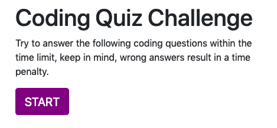
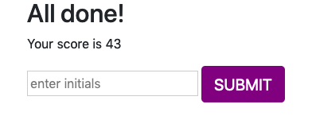

# Homework 4: Creating a Quiz with Javascript

This is the 4th homework in the class, this homework was for the Web-API's unit. 
--
* Files Included in this project
    * index.html
    * style.css
    * script.js
    * README 
    * assets

# The Project

<<<<<<< HEAD

=======

>>>>>>> cb9d1eb48319f5b90c97bf8f2da70e6efd80389c

The Quiz project executes by pressing the start button, once the start button is pressed, the Quiz starts and a countown from 75 seconds starts.

Answer the code related questions within the 75 seconds, however, if you get the answer wrong, 15 seconds are subtracted.  Your total score is the amount of time you have left.   You can record your score at the end of the quiz by typing your name or initials.  The most recent scores are displayed at the end of the quiz. 

<<<<<<< HEAD

=======

>>>>>>> cb9d1eb48319f5b90c97bf8f2da70e6efd80389c
